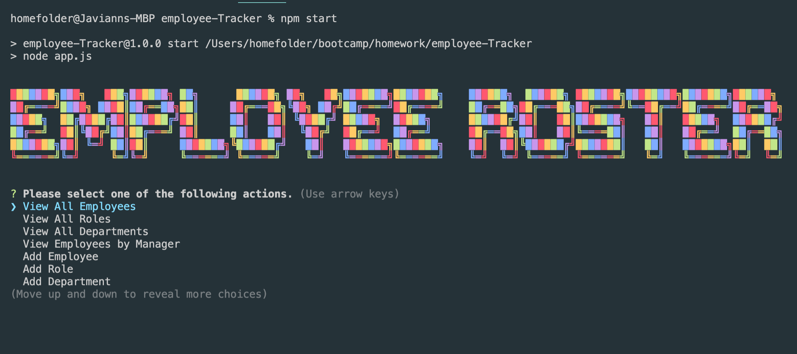

# Unit 12 MySQL Homework: Employee Tracker
[](#license)


# employee-Tracker

## Table of Contents
* [Introduction](#introduction)
* [Demo](#demo)
* [Sample](#sample)
* [Installations](#installations)
* [Usage](#usage)
* [Created by](#created-by)
* [Repository](#repository)
* [License](#license)


## Introduction
An Employee Management CLI interface capable of creating, viewing, updating, and deleting records and saving them in a MySql database.

## Demo

Watch a demo of the application on [Youtube. My Sql Employee-Tracker.](https://youtu.be/y42UnHpQbIc)


## Sample 
 This is a sample of the employee-Tracker application. 
 
 

## Installations
Type the following npm install commands: 
```
1. npm i mysql inquirer console-table-printer figlet colors node
2. npm init -y
```
on the command line while in the employee-Tracker folder. 

* [npm](https://docs.npmjs.com/cli/v7/commands/npm-install)
  * npm is the package manager for the Node JavaScript platform. 

* [mysql](https://www.npmjs.com/package/mysql)
  * Enables the application to create a connection to the mysql database.

* [inquirer](https://www.npmjs.com/package/inquirer)
  * A collection of common interactive command line user interfaces.
  
* [console-table-printer](https://www.npmjs.com/package/console-table-printer)
  * Creates the tables needed to help organize data on the console.
  
* [figlet](https://www.npmjs.com/package/figlet)
  * Enables the text function. 

* [colors](https://www.npmjs.com/package/colors)
  * Adds colors to the the console text.  

* [node](https://www.npmjs.com/package/node)
  * Allows to manage node as a normal dependency.
 
 
 ## Usage

`Open in Integrated Terminal`

To Run application while in the employee-Tracker folder type 
```
npm start 
```

## Created by
* [Javiann Marrero](https://github.com/javiistacks)


## Repository
### Github Repository
Repository at [employee-Tracker](https://github.com/javiistacks/employee-Tracker)


## License

Copyright (c) Javiann Marrero. All rights reserved.<br>
Please be kind and change content if you wish to use this code.

<details><summary>Licensed under the MIT License</summary>

Copyright (c) 2021 - present | Javiann Marrero

<blockquote>
Permission is hereby granted, free of charge, to any person obtaining a copy
of this software and associated documentation files (the "Software"), to deal
in the Software without restriction, including without limitation the rights
to use, copy, modify, merge, publish, distribute, sublicense, and/or sell
copies of the Software, and to permit persons to whom the Software is
furnished to do so, subject to the following conditions:

The above copyright notice and this permission notice shall be included in all
copies or substantial portions of the Software.

THE SOFTWARE IS PROVIDED "AS IS", WITHOUT WARRANTY OF ANY KIND, EXPRESS OR
IMPLIED, INCLUDING BUT NOT LIMITED TO THE WARRANTIES OF MERCHANTABILITY,
FITNESS FOR A PARTICULAR PURPOSE AND NONINFRINGEMENT. IN NO EVENT SHALL THE
AUTHORS OR COPYRIGHT HOLDERS BE LIABLE FOR ANY CLAIM, DAMAGES OR OTHER
LIABILITY, WHETHER IN AN ACTION OF CONTRACT, TORT OR OTHERWISE, ARISING FROM,
OUT OF OR IN CONNECTION WITH THE SOFTWARE OR THE USE OR OTHER DEALINGS IN THE
SOFTWARE.
</blockquote>
</details>
